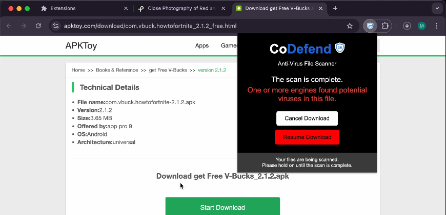

# CoDefend: Decentralized Malware Analysis Chrome Extension

## Project Description

**CoDefend** is an innovative Chrome extension designed to enhance cybersecurity measures by decentralizing malware analysis. Unlike traditional antivirus software that only scans files after they have been downloaded onto a computer, CoDefend intercepts files before they reach the user's system. It processes these files on a dedicated server, which then distributes them to various antivirus API endpoints. This pre-emptive approach ensures multiple layers of analysis and significantly increases the chances of detecting malicious content before it can do any harm.

Our solution leverages the power of decentralization to offer a more robust and comprehensive security framework. By integrating with multiple antivirus engines, CoDefend not only broadens the spectrum of malware detection but also reduces the dependency on a single point of failure, which is common in traditional antivirus software.

Additionally, CoDefend enhances its protective features by analyzing URLs for potentially harmful websites, providing an all-encompassing security tool that safeguards users from both file-based and web-based threats.

## Key Features

* **Decentralized Analysis**: Files are processed, then forwarded and analyzed across multiple antivirus platforms before reaching the user's computer.
* **Real-time Protection**: Instantly scans URLs, offering immediate feedback on potential threats.
* **User-Friendly Interface**: Simple and intuitive Chrome extension that operates seamlessly in the background, providing security without disrupting user experience.
* **Privacy-Focused**: Ensures that user data remains private and secure throughout the analysis process.

## Getting Started

To get started with CoDefend, clone this repository and follow the installation instructions below:

```bash
git clone https://github.com/mark-p7/CoDefend.git
cd CoDefend/server
npm install
```

Next we need to create the keys in a .env file located in the server directory with the following:

```bash
VIRUSTOTAL_API_KEY = "<Add your key here>"
CLOUDMERSIVE_API_KEY = "<Add your key here>"
BYTE_SCALE_API_KEY = "<Add your key here>"
BYTE_SCALE_ACCOUNT_ID = "<Add your key here>"
```

Now we can run the following in /server

```bash
node .
```

Finally, we need to enable the extension in the Chrome browser
1. Go to chrome://extensions/
2. Click Load unpacked
3. Select the CoDefend directory

## Demo

https://www.youtube.com/watch?v=SX1_oJHfAUM

## Screenshots

Here are some screenshots demonstrating the functionality and user interface of CoDefend:

*WebsiteWarning: Showing the real-time scanning feature of URLs.*


*DownloadIntercepted: Showing the UI to scan once a download has been detected.*


*CompleteScanNoVirusesFound: Showing no viruses were found.*


*CompleteScanVirusesFound: Showing viruses were found.*



